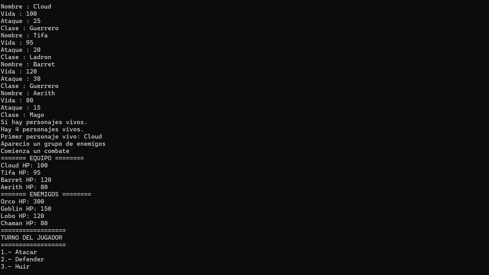
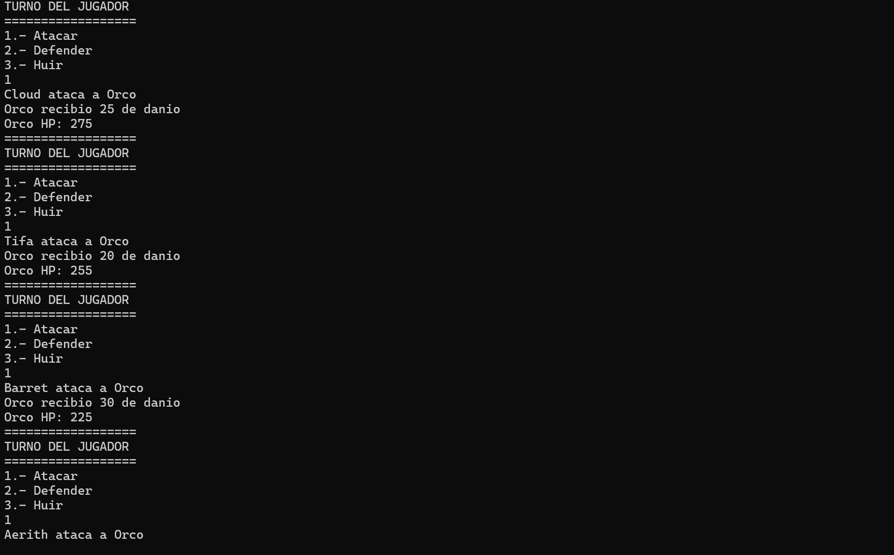
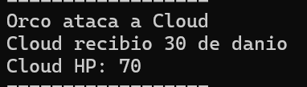
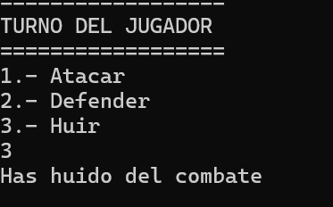

#  Proyecto Integrador - Sistema de Combate por Equipos

Proyecto final del **Módulo 4 – Organización y Tipos** del repositorio **C Learning Journey**.

Este proyecto integra todos los conocimientos adquiridos durante el módulo mediante el desarrollo de un pequeño sistema de combate por turnos inspirado en los RPG clásicos. El objetivo principal no fue crear un videojuego completo, sino aplicar buenas prácticas de organización de código, modularización y diseño utilizando el lenguaje C.

---

# Objetivos del proyecto

- Aplicar estructuras (`struct`) para representar entidades del juego.
- Utilizar `typedef` para mejorar la legibilidad del código.
- Emplear enumeraciones (`enum`) para representar clases, comandos y estados del combate.
- Dividir el proyecto en múltiples módulos con responsabilidades específicas.
- Separar la lógica del combate de la presentación en consola.
- Practicar el paso de estructuras por referencia mediante punteros.
- Organizar el proyecto con una estructura similar a la utilizada en proyectos reales.

---

# Funcionalidades implementadas

- Creación de personajes.
- Clases de personaje.
- Equipos de combate.
- Combate individual.
- Combate por equipos.
- Sistema de turnos.
- Menú de acciones.
- Ataque.
- Defensa.
- Huida del combate.
- Detección de victoria y derrota.
- Visualización del estado de ambos equipos.

---

# Conceptos aplicados

## Organización del código

- Modularización en archivos `.c` y `.h`
- Separación de responsabilidades
- Interfaces públicas mediante archivos de cabecera

## Tipos definidos por el usuario

- `struct`
- `typedef`
- `enum`

## Programación modular

El proyecto está dividido en módulos independientes:

| Módulo | Responsabilidad |
|---------|-----------------|
| personaje | Administración de personajes |
| equipo | Operaciones sobre equipos |
| combate | Lógica del combate |
| interfaz | Presentación en consola |

Cada módulo realiza únicamente la tarea para la que fue diseñado, reduciendo el acoplamiento entre componentes.

---

# Aspectos destacados del proyecto

Durante el desarrollo se aplicaron varias mejoras de diseño que fueron surgiendo de manera natural conforme el proyecto crecía.

Entre ellas destacan:

- Separación entre la lógica del combate y la interfaz de usuario.
- Eliminación de números mágicos mediante constantes (`#define`).
- Organización profesional del proyecto utilizando carpetas `include` y `src`.
- Propagación de estados mediante un `enum` (`ResultadoTurno`) para comunicar eventos como la huida del combate entre distintos niveles del programa.

Esta última mejora permitió resolver un error de lógica en el que el combate continuaba incluso después de seleccionar la opción **Huir**, sin recurrir al uso de variables globales.

---

# Estructura del proyecto


009_Constantes_Y_Organizacion_Del_Codigo
│
├── docs/
├── include/
│   ├── combate.h
│   ├── equipo.h
│   ├── interfaz.h
│   └── personaje.h
│
├── src/
│   ├── combate.c
│   ├── equipo.c
│   ├── interfaz.c
│   ├── main.c
│   └── personaje.c
│
├── tests/
├── LICENSE.txt
└── README.md
```

---

# Ejecución

Al iniciar el programa se crean dos equipos de personajes.

Durante el combate el jugador puede seleccionar una acción para cada integrante del equipo:

- Atacar
- Defender
- Huir

Después del turno del jugador, el equipo enemigo responde automáticamente hasta que uno de los equipos sea derrotado o el jugador decida abandonar el combate.

---

#  Capturas


- Estado inicial de ambos equipos.

- Desarrollo de un turno.

- Ataques y daño recibido.

- Mensajes de victoria, derrota o huida.


---

# Lo aprendido

Este proyecto representó el cierre del Módulo 4 y permitió integrar todos los conceptos estudiados hasta el momento.

Más allá de implementar un sistema de combate, el principal aprendizaje fue comprender cómo organizar un proyecto de software de manera modular, asignando responsabilidades claras a cada componente y facilitando el mantenimiento y la evolución del código.

---
# Evolución del proyecto

El proyecto fue desarrollado de forma incremental a lo largo del módulo.

La evolución fue la siguiente:

1. Creación de la estructura `Personaje`.
2. Uso de `typedef` para simplificar tipos.
3. Incorporación de enumeraciones para las clases.
4. Separación del código en módulos.
5. Implementación de equipos de personajes.
6. Desarrollo del sistema de combate.
7. Implementación del combate por equipos.
8. Separación entre lógica e interfaz.
9. Eliminación de números mágicos mediante constantes.
10. Organización profesional del proyecto utilizando las carpetas `include` y `src`.

# Posibles mejoras futuras

- Sistema de experiencia.
- Inventario.
- Objetos consumibles.
- Habilidades especiales.
- IA con diferentes estrategias.
- Estados alterados.
- Sistema de defensa con reducción de daño.
- Combate contra múltiples enemigos seleccionables.
- Lectura de personajes desde archivos.

---

# Licencia

Este proyecto se distribuye bajo la licencia **MIT**.

Su propósito es exclusivamente educativo y forma parte del repositorio **C Learning Journey**, desarrollado como práctica personal para el aprendizaje del lenguaje C.